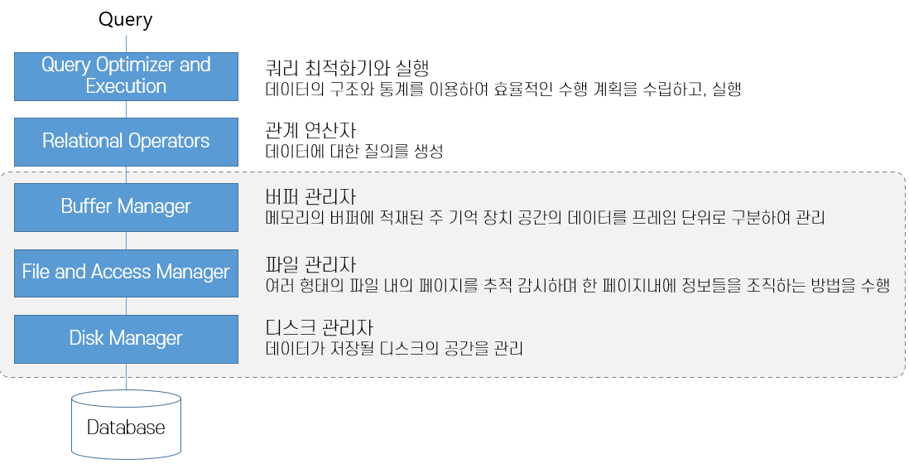

# 7. 디스크와 파일 (23. 11. 09)

DBMS 내부의 데이터는 디스크나 테이프 같은 저장장치에 저장됩니다. DBMS는 논리적 스키마와 물리적 스키마르 분리하기 위해 데이터가 저장되는 구조와 논리적 기술구조를 분리

---

## 디스크와 파일 개요

- DBMS 내부의 데이터는 디스크나 테이프등의 관리에의해 저장
- 디스크 관리자는 디스크 공간을 추적 감시하는 역할 수행
- 처리 과정에 레코드가 필요하게 되면 레코드는 디스크로부터 주 기억 장치로부터 fetch
- 레코드 위치는 파일 관리자가 결정한다.

## 기억장치 계층 구조

- 기억자치 계증 구조는 다음과 같다.
    - 1차 저장 장치 - 캐쉬
    - 2차 저장 장치 - SSD
    - 3차 저장 장치 - 테이프
- 1차 저장장치 같은 경우 소멸성 저장장치
- 비 소멸성 저장장치인 디스크나 테이프를 사용하는 경우도 있음

### HDD

- 기계 장치가 포함된 저장장치로, 자기를 이용하여 데이터를 저장하고 읽음
- 순차 접근 방식이 아닌 직접 접근 방식

### SSD

- 플래시 메모리를 기반으로 한 저장 매체로, Random Access 가능한 빠른 속도의 저장 장치
- 모든 구성요소가 전기장치이며, 기계 장치를 가지지 않음

## 디스크 공간 관리

### 비어 있는 블록의추적 감시

- 레코드를 삽입함에 따라 데이터베이스를 확장되고 축소됨
- DBMS는 사용중인 디스크 블록과 어떤 블록에 존재하는지 추적 감시함
- 추적 감시
- 비어있는 블록들의 리스트를 유지
- 디스크 블록마다 1 비트씩 블록의 사용 여부를 나타내는 비트맵을 유지

### 운영체제 파일 시스템을 이용한 디스크 공간 관리

- 운영체제는 디스크 공간을 관리함
    - 운영체제는 파일을 바이트의 순서(Sequence)로 고수준 서비스를 제공
    - 고수준의 요청을 운영체제에 따른 저수준 명령어로 바꾸어 처리함
- DBMS는 운영체제 파일 시스템을 바탕으로 데이터베이스를 관리하기도 함
- 대부분의 DBMS는 운영체제의 파일 시스템에 의존하지 않음
    - 특정 운영체제의 세부적 사양에 맞추면 다양한 운영체제에서 동작하는 DBMS를 만들기 어려움
    - 운영체제는 최대 파일 크기를 제한하는 경우가 있음
    - 운영체제 파일은 여러 디스크로 분할되지 못함
    - 페이지 참조 패턴을 일반적인 운영체제보다 더 정확히 예측해야 함
    - 페이지를 디스크에 기록하는 시점에 대해 더 많은 제어를 해 주어야 함

## 버퍼 관리자

### 버퍼풀

- 가용한 주 기억장치 공간을 페이지라는 단위로 분할할 데이터 적재 공간
    
    
    
- **버퍼 관리자** 는 필요할때마다 디스크로부터 페이지를 가져와 기억장치에 적재하는 DBMS 의 SW 계층
- 이런 페이지가 모여있는 공간을 **Buffer Pool** 이라고 함.
- 버퍼 풀 내의 페이지를 **Frame** 이라고 하는데 페이지를 담을 수 있는 슬롯
- 버퍼 관리자는 버퍼 풀 에서 `pin_count` 와 `dirty` 라는 두 개의 변수를 유지
- `pin_count` 는 현재 프레임 내에 있는 페이지를 사용하고 있는 사용자의 수
- `dirty` 는 boolean 타입 변수로서, 페이지가 디스크로부터 버퍼 풀에 적재된 이후 수정된 적이 있는지를 나타낸다.
    - `dirty` 비트가 true 라는 것은 데이터가 변조됬다는 것을 표시
    - 즉! 디스크에 새로 써야한다는 것을 표현한다.
- 처음에는 각 프레임의 `pin_count` 를 0으로 설정하며 dirty는 false로 설정
    - diry를 바꿀시에 log 에 적용하여 이를 바탕으로 데이터 베이스를 복원한다.
    - *WAL*
- 페이지 요청시 페이지 풀에 없을 경우 버퍼 관리자는 아래와 같은 작업을 수행
    - 정해진 페이지 교체 알고리즘에 따라 교체 프레임 서택
    - 프레임의 `dirty` 비트가 **true** 일경우 디스크에 저장
    - 요청 페이지를 프레임에 로드
    - 요청 페이지의 `pin_count` 를 1 증가
        - 이를 *Pinning* 이라고 한다
        - 지금 현재 페이지를 누군가가 보고 있다.

### 버퍼 교체 전략

*운영체제랑 거의 동일하다!*

- LRU (Least Recently Used)
    
    pin_count가 0인 프레임들에 대란 포인터로 큐를 생성
    
- Clock
    
    LRU의 변형으로, 1부터 N 사이의 값인 current 변수를 사용하여 교체용 페이지를 선정
    
- FIFO (First In First Out), MRU(Most Recently Used), Random등의 방식을 사용

---

**비교**

- 운영체제의 가상 메모리와 DBMS의 버퍼 관리자는 매우 비슷함
- DBMS는 페이지 참조 패턴을 일반적인 운영체제 환경보다 더 정확히 예측해야 함
    - DBMS는 참조 패턴을 예측할 수 있으므로 페이지 우선 적재 전략을 사용할 수 있음
- DBMS는 페이지를 디스크에 강제 출력할 수 있어야 함
    - 손상 복구를 위한 WAL 규약을 실현할 수 있음
    - WAL : 로그를 적고 그것을 통해 복구 하는것

---

## 레코드

- 고정 길이 레코드
- 가변 길이 레코드

### 고정 길이 레코드

- 각 필드의 길이가 고정적이고 필드의 수도 고정된 레코드 형식
- 필드를 레코드에 연속적으로 저장

### 가변 길이 레코드

- 필드의 길이가 가변적인 경우 해당 레코드의 길이가 가변적이 됨
- 필드를 분리자로 구분하여 연속적으로 저장

- 수정시에 불이익이 존재
    - 필드 추가시 뒤의 정보들을 모두 뒤로 이동
    - 너무 커지면 분할할 필요가 있음

## 파일과 인덱스

### 힙 파일

- 가장 간단한 파일 구조로, 레코드가 파일의 빈 공간에 순서 없이 저장
- 페이지 내의 데이터가 어떠한 형태로도 정렬되지 않으며, 파일의 모든 레코드를 검색하면 다음 레코드를 되풀이해서 요청해야 함
- 파일의 레코드는 각기 유일한 rid를 가지며, 한 파일에 속하는 페이지는 크기가 모두 같음
- 파일의 생성(Create)과 제거(Destroy), 레코드의 삽입(Insert)과 rid를 통한 레코드 삭제(Delete), rid를 통한 레코드 선택(get), 파일 내의 모든 레코드 스캔(Scan) 연산 지원

### 인덱스

- 대부분의 자료 구조에서는 저장된 데이터의 rid를 직접 알 수 없음
- 정렬되지 않은 자료 구조에서 동등 검색을 수행할 경우, 전체 자료 구조를 스캔해야 함
- 인덱스(Index)
    
    선택(Selection) 조건에 맞는 rid를 구할 수 있도록 만든 보조 자료 구조
    
    
    

### ISAM

- 색인 순차 접근 방식(Indexed Sequential Access Method) 파일
- 데이터를 순서대로 저장하거나 특정 항목을 색인으로 처리할 수 있는 파일 처리 방법
- 인덱스를 순차적으로 구성하여 큰 인덱스의 성능 문제를 해결
    - 인덱스 파일이 클 경우, 인덱스를 계층화하여 인덱스에 대한 인덱스를 생성
    - 완전한 정적 구조로, 인덱스 계층의 페이지가 수정되지 않음
- 파일 구조
    - 인덱스 구역(비 단말 페이지)
        
        기본 구역에 있는 레코드들의 위치를 찾아가는 인덱스가 기록되는 구역
        
    - 기본 구역(기본 단말 페이지)
        
        실제 레코드들을 기록하는 부분으로, 각 레코드는 키 값 순으로 저장
        
    - 오버플로우 구역(오버 플로우 페이지)
        
        기본 구역에 빈 공간이 없을 경우 새 레코드의 삽입을 위한 예비적 구역
        
        오버플로우 구조까지 탐색을 시도 할경우 속도가 기하급수적으로 늦는다.
        

### B+ 트리

- ISAM의 오버 플로의 단점을 개선한 동적 트리 자료구조
- 내부 노드들이 탐색 경로를 유도하고 단말 노드들이 데이터 엔트리를 가지는 균형 트리
    - 트리에서 삽입, 삭제를 수행해도 트리의 균형이 유지됨
    - 레코드를 탐색할 때 루트로부터 알맞은 단말 까지만 가면 됨
- 일반적으로 ISAM보다 우수한 구조

## 시스템 카탈로그

- 데이터베이스는 자신이 가지고 있는 모든 데이터에 대한 설명 정보를 저장함
- 관계형 데이터베이스 관리 시스템은 생성된 모든 릴레이션과 인덱스에 대한 정보를 유지 관리
- 시스템 카탈로그(System Catalog), 데이터 사전(Data Dictionary), 마스터 데이터베이스(Master Database), 메타데이터(Metadata)라고도 부름
