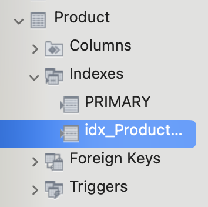
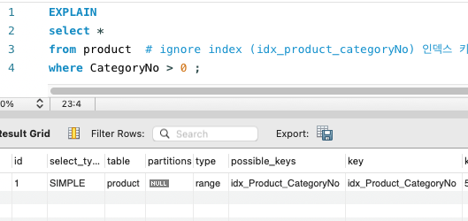

# 8. 파일 조직과 인덱스 (23. 11. 10)

디스크에 저장 된 파일들을 레코드에 배치하는 방법 효율적인 DBMS 조작법을 위해 패턴을 파악해 효율적인 파일조직을 선택한다.

## 비용 모델과 파일 조작법

### 비용 모델 개요

- 데이터베이스에서는 질의가 요청될 때 여러 실행계획을 세우고 최적화된 방법을 찾아 실행
- 쿼리 최적화기는 쿼리 기반, 비용 기반 등의 모델로 실행 계획을 비교
- 비용 측정
    - 데이터 페이지의 개수 B, 페이지에 속한 레코드의 개수 R, 디스크 페이지를 하나를 읽는 시간을 D로 가정
    - 디스크 페이지 하나를 쓰는데 걸리는 평균 시간 D, 한 레코드를 처리하는데 걸리는 시간 C
    - 한 레코드에 해시 함수를 적용하는데 걸리는 시간 H
- 여기에서는 파일 입출력 비용만 감안하여 파일 조직 별 비용을 비교
- 쿼리 최적화기는 두가지로 나눈다.
    - 규칙기반 옵티마이저
    - 비용기반 옵티마이저

### 파일 조직법 비교 기준 연산

- **스캔**, **동등** **설렉션**, **범위 설렉션**, **삽입**, **삭제**로 나누어 구분한다.

### Heap

- 정렬되지 않은 단순한 형태의 파일
- 스캔 B(D+RC)
- 동등 셀렉션 후보 키에 대한 연산일 경우 0.5B(D+RC). 후보 키가 아닌 경우 스캔과 동일
- 범위 셀렉션 스캔과 동일
- 삽입 레코드가 항상 파일의 끝에 삽입된다고 가정할 경우 2D+C
- 삭제 탐색 비용 + C + D
- **힙은 삽입에 있어 가장 좋은 성능을 낸다.**

### 정렬 파일

 특정 필드를 기준으로 정렬된 파일

- 스캔
    
    힙 파일과 다르지 않음. B(D+RC)
    
- 동등 셀렉션
    
    정럴 기준 필드로 검색할 경우 이진 탐색으로 *Dlog2B* + *Clog2R*. 정렬 필드가 아닌 경우 스캔과 동일
    
- 범위 셀렉션
    
    정렬 기준 필드로 검색할 경우 첫 레코드를 찾는데 동등 셀렉션과 동일. 이후 범위내 스캔
    
- 삽입
    
    정렬 순서를 유지하기 위해 레코드가 삽입될 위치를 검색 후 레코드 추가. 후속 페이지를 모두 로드하여 다시 저장 (뒤로 전부 한칸씩 이동해야함) 탐색 비용 + B(D + RC)
    
    만약에 데이터를 넉넉히 만들어놓은다면 삽일 할때 뒤 데이터를 재조직 할 필요가 없다.
    

### 해시 파일

해시 함수를 통해 데이터를 버킷 단위로 저장하는 방식 → 해시 (ex: 해시맵)

- 스캔
    
    해시에서는 일반적으로 페이지의 80% 정도를 채운다 1.25B(D + RC)
    
- 동등 셀렉션
    
    해시키에 의한 검색조건이라면 H + D + 0.5RC, 아닌 경우 스캔과 동일
    
- 범위 셀렉션
    
    스캔과 동일 
    
- 삽입
    
    적절한 페이지에 다시 기록 
    

### 결론

- 힙 파일은 저장성능이 우수 스캔, 삽입, 삭제 연산은 빠르지만 탐색이 느리다.
- 정렬 파일 또한 저장 성능이 우수하고 삽입, 삭제에는 느리지만 탐색은 빠르다!
- 해시 파일은 저장성능이 떨어지지만 삽입과 삭제가 빠르며 동등 탐색에 대해서는 대단히 우수하다. 하지만 범위 탐색을 지원하지 않음

**탐색의 왕** : 정렬 *(넉넉한 메모리 가지고 있을 경우 가장 좋다.)*

**전체적으로 무난** : 힙

**삽입과 삭제의 왕** : 해시 *(쓰기 전문인 log 파일의 경우는 우수)*

---

## 인덱스

*→ 해당 자료구조의 데이터 검색 속도를 높이기 위한 보조 자료구조*

### 클러스터드 인덱스

- 파일을 조직할 때 레코드의 순서를 파일에 대한 인덱스의 순서와 동일한 순서로 유지
    - 테이블의실제 데이터 순서 = 인덱스의 순서
    - 스캔에 유리
- 파일의 재조직이 필요한 구조
- 데이터가 삽입/삭제될 때 마다 정렬 순서를 유지하기 위해서 그 주변의 데이터를 이동해야 함
    - 삽입 / 삭제 느리다.
- 파일이 동적으로 변하는 경우 유지 관리 오버헤드가 높음
- 주소록을 성과 이름순으로 정리한다면?
    - 성과 이름이 일치한 사람은 서로 가까이 위치 (본래 주소록은 성과 이름으로 정렬)

**데이터가 클러스터드(군집) 형태로 인덱스 순서대로 저장되는 방식**

### 넌 클러스터드 인덱스

- 하나의 데이터 파일은 하나의 탐색키에 대해서만 클러스터링 될 수 있음
- 하나의 데이터 파일에 대해 하나의 클러스드 인덱스만 만들 수 있음
- 클러스터드 인덱스 구조 파일의 키가 아닌 필드의 빠른 검색을 위한 보조 자료구조
- 주소록을 이메일 번호 정리
    - 실제 데이터 구조는 성과 이름이지만 이메일 순으로 인덱스만 정렬함  인덱스(이메일)로는 빨리 찾을수는 있지만… 실제 순서와 일치 하지 않음

### 밀집 인덱스와 희소 인덱스

- 밀집 인덱스(Dense Index)
    - 파일에 있는 모든 탐색 키 값에 대해 데이터 엔트리를 구성
    - *복합키 인덱스 라고 불릴려나…?*
- 희소 인덱스(Sparse Index)
    - 데이터 파일의 페이지별로 하나의 데이터 엔트리를 구성

### 기본키와 보조 인덱스

- 기본 키를 포함한 필드들에 대한 보조 인덱스를 기본 인덱스라고 부름
    - 기본 키가 존재하는 테이블은 기본 키가 클러스터드 인덱스가 되고 해당 자료구조로 테이블을 조직하는 DBMS도 있음
    - 기본 키를 희소, 클러스터드 인덱스로 지정하는 DBMS도 있음
- 기본 키 이외의 인덱스들을 보조 인덱스로 부름
    - 동일한 탐색 키 필드에 대해 데이터 엔트리가 두 개 존재하는 경우 중복되었다고 함
    - 키 필드가 아닌 필드에 대한 인덱스에는 중복이 나타날 수 있음
- 해당 탐색 키에 후보 키가 포함되는 경우, 그 키에 대한 인덱스를 유일 인덱스라고 부름

### 복합 키 인덱스

- 인덱스가 여러 필드를 참조 할경우 복합 키
- 특정 쿼리에 대해 높은 성능
- ex: 나이, 이름을 통해 인덱스를 만드는것

---

## 실습

- `CREATE INDEX idx_Product_CategoryNo ON Product(CategoryNo);`

- CategoryNo을 Index로 추가

- `SELECT * FROM Product WHERE CategoryNo > 0;`

- 자동으로 정렬이된다.
- `Where` 식에서 `CategoryNo` 를 활용해 찾는 도중 Index를 활용함을 알 수 있음
- `EXPLAIN` 을 활용해서 index 보기

→ msSQL 은 이런식으로 정렬이 안된다.

정렬 하기 위해 Index를 사용하는 것은 위험한 생각…