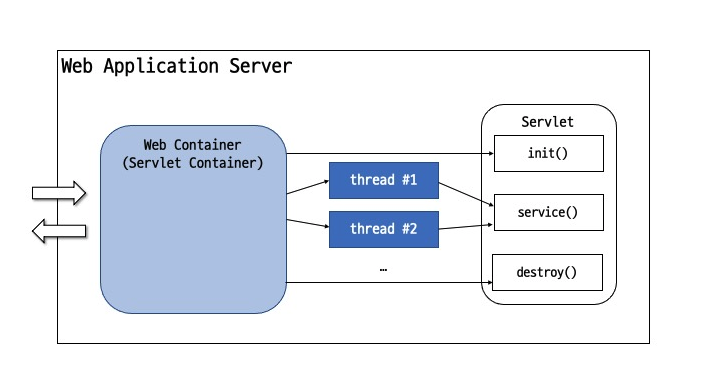

# Servlet(23. 11 .21)

### 정의

- Java를 사용하여 동적 웹 콘텐츠를 생성하는 서버 측 프로그램
- 쉽게 말해, Java로 만든 CGI 프로그램 같은 것
- Servlet 인터페이스를 정의
    - 즉 Servlet 인터페이스를 구현 → java로 구현한 CGI 프로그램이라 할 수 있습니다.

### 기존 CGI보다 뭐가 더 좋아졌는가?

- 요청마다 새로운 프로세스가 생성 (CGI) → 멀티 스레드로 해결
- 스레드는 누가 생성하고 관리하나 → 컨테이너의 등장

## Servlet Architecture

### Servlet Container ( wiki )

- 웹 컨테이너(web container, 또는 서블릿 컨테이너)는 웹 서버의 컴포넌트 중 하나로 자바 서블릿과 상호작용한다.
- 웹 컨테이너는 서블릿의 생명주기를 관리하고, URL과 특정 서블릿을 맵핑 하며 URL 요청이 올바른 접근 권한을 갖도록 보장한다.
- 웹 컨테이너는 서블릿, Java Server Page(JSP) 파일, 그리고 서버-사이드 코드가 포함된 다른 타입의 파일들에 대한 요청을 다룬다.
- 웹 컨테이너는 서블릿 객체를 생성하고, 서블릿을 로드와 언 로드하며, 요청과 응답 객체를 생성하고 관리하고, 다른 서블릿 관리 작업을 수행한다.
- 웹 컨테이너는 웹 컴포넌트 Java EE 아키텍처 제약을 구현하고, 보안, 병행성(concurrency), 생명주기 관리, 트랜잭션, 배포 등 다른 서비스를 포함하는 웹 컴포넌트의 실행 환경을 명세한다(specify).

## Servlet 실습

## WAS

- (Java) Application Server라고 불림
- 정적 웹 서버와 구분하기 위한 용도
- Servlet Container, EJB Container등의 역할을 수행함
- 동적 웹을 제작하기 위한 웹 어플리케이션과 서버 환경을 만들어 동작시키는 기능 제공
- 서블릿에만 한정적으로 WAS = Servlet Conatiner라고 봐도 좋다.

### Servlet API

- Java EE 에서는 Servlet API Spec 만 정의
- 실제 구현은 WAS에서 담당
- ex)
    - Servlet API: `javax.servlet.http.HttpServletRequest interface`
    - tomcat 구현: `org.apache.catalina.connector.Request class`

### tomcat

- apache 재단에서 개발한 무료 오픈 소스 WAS(Web Application Server)
- Servlet Container의 reference 구현

> *Servlet-api 의존 라이브러리가 scope가 provided인 이유*
> 

→ **tomcat** 에서 기본적으로 servlet api를 제공하기에 scope를 provided로 지정한다면 패키징시에 제외된다.