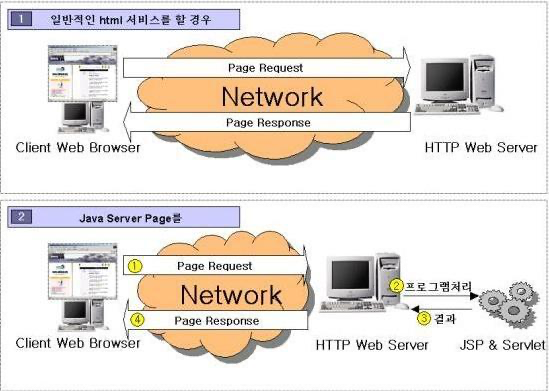

# JSP

- **JSP란?**
    - 자바 스크립트와는 다르다.
    - Java Server Pages의 약자
    - HTML에 JAVA 코드를 넣어 동적 웹 페이지를 생성하는 웹 어플리케이션 도구
    - JSP 실행시 JAVA Servlet으로 변환되어 웹이 동작한다!
- *Servlet* 의 확장형
    - 서블릿의 모든 기능에 대해 추가적인 기능을 가진다!
- html과 동작 원리 차이

  
    
- JSP 와 Servlet의 차이

  
    
- 전체적인 JSP 동작 구조

  
    
    1. Client가 서버에 Hello.jsp를 요청한다.
    2. JSP 컨테이너가 JSP 파일을 읽는다.
    3. JSP 컨테이너가 Generate 작업을 통해 Serlvet 파일을 생성한다.
    4. .java는 컴파일 되어 .class 파일이 된다.
    5. HTML을 Client에 제공한다.

***즉 jsp → Servlet + a 로 변경된다.***

---

## 기본 문법

## <%@ %>

- `page`: JSP 페이지에 대한 정보

```
<%@ page contentType="text/html;charset=UTF-8" language="java" %>
```

- `include`: JSP 파일 안에 다른 JSP나 HTML 파일을 포함

```
<%@ include file="/some/path/content.html" %>
```

- `tablib`: 태그 라이브러리 선언

```
<%@ taglib uri="http://java.sun.com/jsp/jstl/core" prefix="c" %>
```

### <%= %>

- 변수, 메서드 호출 등 표현식(expression)의 실행 결과를 출력

```
<%= "Hello, World!" %>
```

```
<%= 17 * 5 %>
```

```
<%= request.getParameter('name') %>
```

- 전역변수
    - outside the _jspService() method

### <%! %>

- 변수나 메서드 등을 선언

```
<%! String name = "James" %>
```

```java
<%!
    public int minus(int i, int j) {
        return i - j;
    }
%>
```

- 지역변수
    - inside the _jspService() method.

### <% %>

- `<%` 와 `%>` 사이에 있는 코드를 실행

```java
`<%
    int a = 3;
    int b = 2;

    if (a > b) {
        out.println(minus(a, b));
    }
%>`
```

### if-else

```
<% if (x < 0) { %>
    <p>negative</p>
<% } else { %>
    <p>zero or positive</p>
<% } %>
```

### for, while, do/while

```java
<table>
<tr>
<% for (i = 0; i < 10; i++) { %>
    <td><%= i + 1 %></td>
<% } %>
</tr>
</table>
```

## JSP 내장 객체

| 객체 | 타입 | 설명 |
| --- | --- | --- |
| page | javax.servlet.jsp.HttpJspPage | page의 Servlet 인스턴스 |
| config | javax.servlet.ServletConfig | ServletConfig |
| request | HttpServletRequest | 요청 객체 |
| response | HttpServletResponse | 응답 객체 |
| out | javax.servlet.jsp.JspWriter | page 컨텐트 출력용 스트림 |
| session | javax.servlet.http.HttpSession | 세션 |
| application | javax.servlet.ServletContext | ServletContext |
| pageContext | javax.servlet.jsp.PageContext | JSP page의 실행 context |
| exception | java.lang.Throwable | 처리되지 않은 에러나 예외 |

**forward vs include**

- `/pageContext.jsp?type=include`
    - **include는 해당 URL로 제어권을 넘기지만 include처리가 끝나면 다시 제어권은 원래의 페이지로 돌아옴 ( 즉 해당 페이지에 삽입하는것과 같음 )**

  
    
- `/pageContext.jsp?type=forward`
    - **forward는 요청과 응답에 대한 제어권을 URL로 지정된 주소로 영구적으로 넘김. -> 종료**

  
    

---

## Java Beans

- Java로 작성된 재사용 가능한 소프트웨어 컴포넌트
- 자바빈 규격이라는 엄격한 지침에 따라 어디서나 재사용성이 높음
- java로 작성된 소프트웨어 컴포넌트
- **Java Beans 지켜야할 관례**
    - 클래스는 직렬화 되어야 합니다.
    - 클래스는 기본 생성자를 가지고 있어야 합니다.
    - 클래스의 속성들은 get, set 혹은 표준 명명법을 따르는 메서드들을 사용해 접근할 수 있어야 합니다.
    - 클래스는 필요한 이벤트 처리 메소드들을 포함하고 있어야 합니다.

### POJO

- 특정 기술과 환경에 종속한 Java는 재사용성이 매우 떨어진다.
- 객체 지향의 장점을 잃어버리는 현상
- 컨벤션, 프레임워크를 따르지 않은 Java 오브젝트를 의미
    - 특정 규약, 환경에 종속되지 않는다.
    - 객체 지향적 원리에 충실
- **POJO 프레임 워크**
    - Spring 프레임 워크가 대표적인 POJO이다.

### Java beans의 간단한 예제

```java
public class User implements Serializable {
    private String userName;
    private int userAge;
    private boolean coding;

    public User(){}

    public String getUserName() {
        return userName;
    }

    public void setUserName(String userName) {
        this.userName = userName;
    }

    public int getUserAge() {
        return userAge;
    }

    public void setUserAge(int userAge) {
        this.userAge = userAge;
    }

    public boolean isCoding() {
        return coding;
    }
```

### POJO VS Java Beans

| POJO | JavaBeans |
| --- | --- |
| Java language에 의해 강제되는 것 외에는 특별한 제한이 없습니다. | 몇 가지 제한 사항이 있는 특수 POJO 객체입니다. |
| Field에 대한 통제를 제공하지 않습니다. | Field에 대한 통제를 제공합니다. |
| 직렬화 가능한 인터페이스를 구현할 수 있습니다. | 반드시 직렬화 가능한 인터페이스를 구현해야 합니다. |
| 필드는 이름으로 접근할 수 있습니다. | 필드는 getter, setter에서만 접근할 수 있습니다. |
| 인수가 없는 default생성자가 있을 수도 있고 없을 수도 있습니다. | 반드시 인수가 없는 default생성자가 존재해야 합니다. |